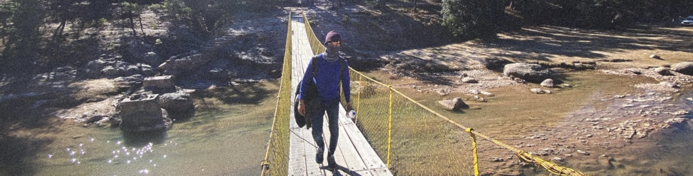
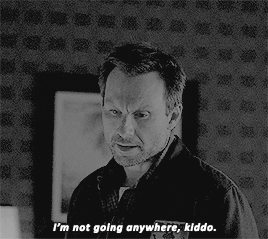
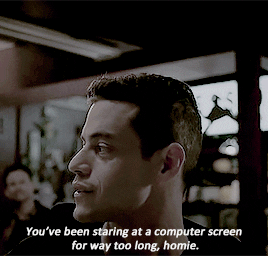

# Bienvenido a mi Github, soy Edgar López 👋🏼

📌 Mérida, Yucatán.

### Soy *ingeniero en software* con *tres años de experiencia* profesional.

👨🏻‍💻 Actualmente tengo 24 años y me encuentro ***trabajando con React y React Native*** para una startup llamada Ecubi.

📕 Me encuentro profundizando en el funcionamiento de ***JavaScript*** para ***optimizar proyectos*** escritos en este lenguaje y aprendiendo ***Rust*** para el desarrollo de ***herramientas de programación***.

### ¿Algun proyecto o comunidad?
👀 Me encantaría ***colaborar en proyectos de código abierto*** y actualmente me encuentro ***buscando*** donde pueda echar una mano y mejorar como desarrollador.

☕️ Si te gustaría ponerte en contacto o tomar un café  conmigo, aquí te dejo mis redes sociales.

☝🏼 Me encanta aprender sobre ***ciencia y tecnología***, soy un poco inquieto así que paso parte de mi tiempo estudiando y practicando con ***proyectos propios o cursos***, como podrás ver en mis repositorios. A veces me gusta ***compartir mi aprendizaje*** y mi gusto por los videojuegos en mis redes.

### ¡Encantado de conocerte! ☺️

<!--

Here are some ideas to get you started:

- 🔭 I’m currently working on ...
- 🌱 I’m currently learning ...
- 👯 I’m looking to collaborate on ...
- 🤔 I’m looking for help with ...
- 💬 Ask me about ...
- 📫 How to reach me: ...
- 😄 Pronouns: ...
- ⚡ Fun fact: ...
-->
